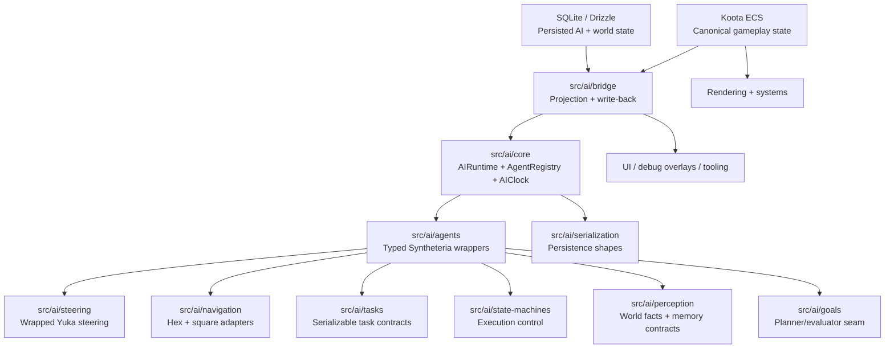
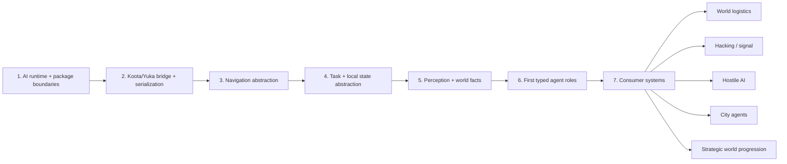

# AI Foundation Plan

This document defines the first-class AI architecture for Syntheteria. It is intentionally breadth-first: the goal is to establish the most interconnected system boundary before building more feature-specific consumers like logistics, hacking, cultists, or city workers.

## Planning Set

- [AI System Map](./AI_SYSTEM_MAP.md)
- [Yuka Audit](./YUKA_AUDIT.md)
- [AI Requirements](./AI_REQUIREMENTS.md)
- [AI Test Strategy](./AI_TEST_STRATEGY.md)

## Purpose

The AI layer exists to do four things:

1. Own deterministic agent-side behavior execution.
2. Bridge canonical game state from Koota into Yuka-backed runtime agents.
3. Persist Syntheteria-owned AI state without depending on opaque Yuka internals.
4. Present stable contracts for downstream systems so we stop writing feature-local movement or behavior logic.

## Ownership

- Koota remains the canonical gameplay-state owner.
- SQLite remains the canonical persisted-state owner.
- Yuka becomes the runtime behavior substrate.
- `src/ai` becomes the only valid place to create new Yuka-driven gameplay behavior.

## Architecture



## Package Layout

```text
src/ai/
  agents/          Typed Syntheteria agent wrappers.
  bridge/          Koota <-> Yuka projection and write-back.
  core/            Runtime, clock, registry.
  goals/           Future GOAP/evaluator seam.
  navigation/      Hex and square-grid navigation adapters.
  perception/      World facts, memory, visibility contracts.
  serialization/   Canonical persisted AI state.
  state-machines/  Deterministic local execution control.
  steering/        Wrapped steering policies and tuning.
  tasks/           Serializable task definitions.
  testing/         Deterministic harnesses and fixtures.
```

## Dependency Order

This order is mandatory. If a downstream system needs a boundary that is not built yet, the correct move is to expand `src/ai`, not to bypass it.



## Rules

- Do not bind new gameplay systems directly to ad hoc movement code when that system is behavior-driven.
- Do not persist raw Yuka instances or assume Yuka JSON is sufficient as save data.
- Do not let React components own AI state transitions.
- Do not add a new AI package without first defining its owner, inputs, outputs, and serialization contract.

## Acceptance Criteria

- The `src/ai` package boundaries are explicit and non-overlapping.
- Koota/Yuka ownership is explicit per state category.
- Serialization contracts are defined for all persisted AI state.
- A downstream engineer can implement the first real AI consumer without inventing new architecture.
- The AI layer is deterministic and testable without rendering.

## Immediate Code Deliverables

This phase includes the following concrete implementation:

- `src/ai` scaffold with package boundaries.
- legacy `GameEngine` shim removed; fixed-step simulation now updates `AIRuntime` directly from ECS game-state orchestration.
- deterministic clock, registry, bridge, serialization, and harness utilities.
- architecture docs and acceptance matrix.

## First Consumer After This Phase

The first full consumer should be world logistics and campaign agents:

- route servicing
- claim/found task flow
- load/unload behavior
- persisted hauler state

That work should consume `src/ai`, not extend today’s world logic with one-off movement state.
