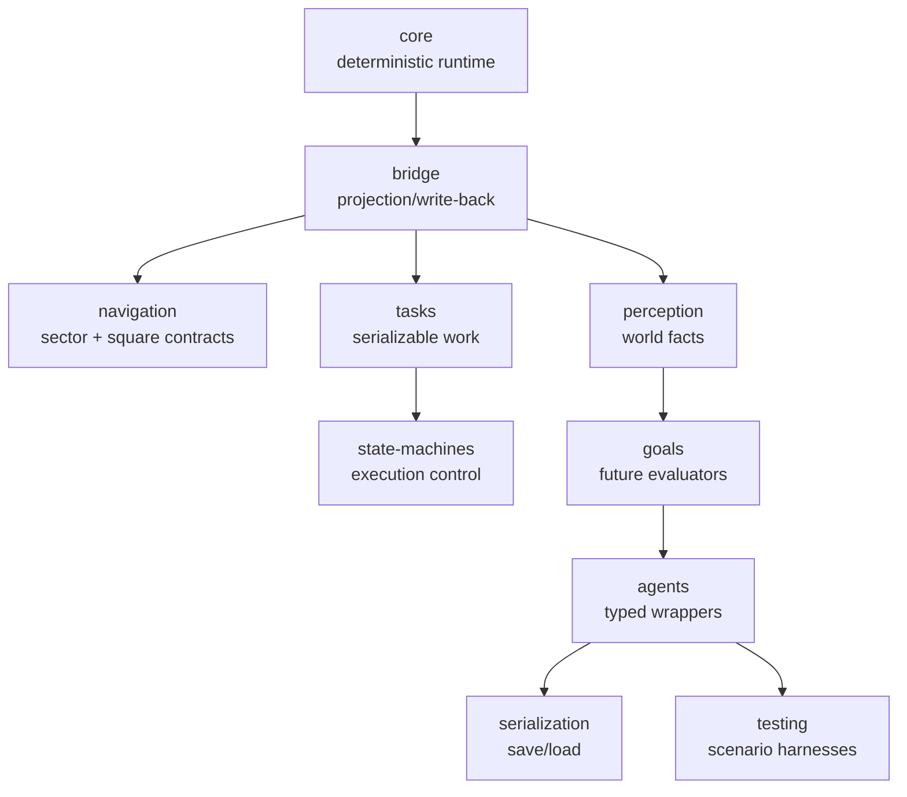

# AI Requirements

This document defines the formal requirements for the AI layer by downstream consumer.

## Global Invariants

- AI must update independently of React render timing.
- AI behavior must be deterministic for a fixed world seed, save state, and input stream.
- Koota owns canonical gameplay state.
- persisted AI state must be Syntheteria-defined and versionable.
- all critical AI behavior must be testable headlessly.

## Requirement Matrix

### World Campaign

- Description: agent execution for claiming, founding, travel, extraction, and route servicing.
- Source systems: world generation, POIs, logistics, save/load.
- Mandatory invariants:
  - route tasks can resume after save/load
  - movement consumes navigation adapters, not ad hoc direct position nudges
  - no hidden global inventory/route state
- Persistence needs:
  - active task
  - task phase
  - steering target
  - local memory facts that affect route continuation
- Test needs:
  - travel-to-node
  - load/unload
  - interruption and resume
- Deferred notes:
  - multi-agent optimization and manual route authoring are later scope

### Hacking / Signal / Compute

- Description: connectivity-aware agent behaviors for signal links, hacking jobs, and compute-constrained actions.
- Source systems: hacking, power, signal/compute BFS network.
- Mandatory invariants:
  - tasks can fail or stall when connectivity disappears
  - target selection uses world facts, not UI state
  - interruption is explicit and serializable
- Persistence needs:
  - target node
  - active hack task
  - interruption cause
- Test needs:
  - connectivity lost
  - reconnect and resume
  - target substitution rules
- Deferred notes:
  - rich adversarial counter-hacking is later

### Combat / Hostile AI

- Description: pursuit, flee, regroup, attack-range management, and threat response for hostile machines and cultists.
- Source systems: combat, enemies, cultist systems.
- Mandatory invariants:
  - state switching is explicit
  - steering and attack choices are decoupled
  - threat behaviors are deterministic in tests
- Persistence needs:
  - current target
  - threat memory
  - state/goal/task
- Test needs:
  - acquire target
  - lose target
  - pursue/flee transitions
- Deferred notes:
  - advanced squad coordination is later

### City Simulation

- Description: local jobs, worker/task routing, and square-grid traversal inside founded settlements.
- Source systems: city instances, Quaternius assembly, local fabrication.
- Mandatory invariants:
  - city traversal uses square-grid navigation adapter
  - city jobs use the same task/state contracts as world agents where possible
- Persistence needs:
  - assigned job
  - local route
  - work progress
- Test needs:
  - square-grid route contracts
  - job interruption
- Deferred notes:
  - rich population simulation is later

### Narrative / Onboarding

- Description: predictable scripted or semi-scripted behavior for intro beats and tutorialized sequences.
- Source systems: title/intro, story progression, mission scripting.
- Mandatory invariants:
  - scripted behavior can override evaluators cleanly
  - sequences remain replayable and deterministic
- Persistence needs:
  - active scripted phase
  - current objective target
- Test needs:
  - scripted movement sequence
  - interruption and recovery
- Deferred notes:
  - cinematic choreography is later

### Persistence

- Description: exact save/load restoration of active AI state.
- Source systems: SQLite, bootstrap, load pipeline.
- Mandatory invariants:
  - save/load must not silently drop AI task state
  - versioned serialization is required
  - schema evolution must be explicit
- Persistence needs:
  - every active agent's serialized AI contract
- Test needs:
  - round-trip equality for persisted bundles
  - version guard failures
- Deferred notes:
  - migration tooling can expand later

### Testing

- Description: deterministic replayable AI validation.
- Source systems: Jest/unit harnesses, future scenario runners.
- Mandatory invariants:
  - core AI contracts run headlessly
  - scenario fixtures do not require Three/React
- Persistence needs:
  - reusable serialized fixtures
- Test needs:
  - unit
  - bridge
  - serialization
  - scenario
  - contract
- Deferred notes:
  - visual overlays are secondary to simulation tests

### Performance

- Description: scalable update behavior for many agents without frame-coupled logic.
- Source systems: runtime loop, mobile/web targets.
- Mandatory invariants:
  - fixed-step update
  - no React-driven behavior updates
  - no per-frame allocation-heavy save transforms on the hot path
- Persistence needs:
  - snapshotting must be explicit, not continuous
- Test needs:
  - deterministic fixed-step assertions
  - harness-level multi-agent smoke tests
- Deferred notes:
  - profiling thresholds should be formalized once first consumer lands

## Package-Level Requirements

Each package must satisfy:

- explicit owner
- explicit inputs and outputs
- deterministic tests
- no hidden dependency on rendering

## Deferred Capabilities

These capabilities are intentionally not required in the first implementation wave:

- fuzzy desirability modeling
- tactical group formations
- full GOAP planning
- rich sensory occlusion
- player-authored route-editing tools
