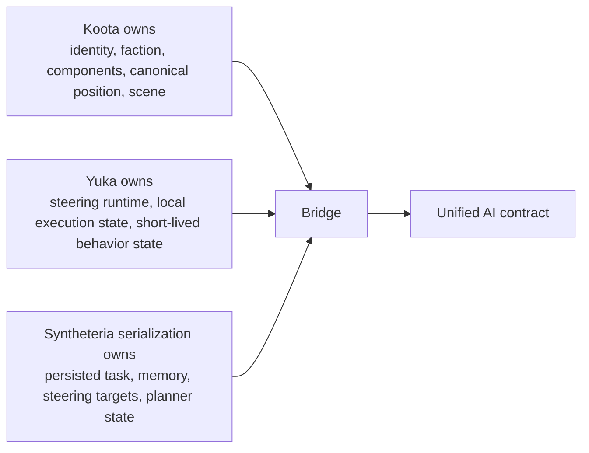

# AI System Map

This document maps Syntheteria's AI-adjacent systems by ownership and dependency. The purpose is to identify the tentacles first so feature work stops bypassing the eventual AI substrate.

## Tentacle Map

```mermaid
flowchart TD
    AI["AI foundation"] --> W["World campaign"]
    AI --> H["Hacking / signal / compute"]
    AI --> C["Combat / hostile behavior"]
    AI --> CI["City simulation"]
    AI --> N["Narrative / onboarding scripting"]
    AI --> P["Persistence"]
    AI --> T["Testing / replay"]
    AI --> R["Rendering / debug readouts"]

    W --> W1["Route following"]
    W --> W2["Found / claim tasks"]
    W --> W3["Extraction + hauling"]

    H --> H1["Target selection"]
    H --> H2["Connectivity-aware actions"]
    H --> H3["Interrupt / stall semantics"]

    C --> C1["Pursuit / flee / regroup"]
    C --> C2["Attack state switching"]

    CI --> CI1["Square-grid jobs"]
    CI --> CI2["Local navigation"]

    N --> N1["Semi-scripted sequences"]
    N --> N2["Predictable intro beats"]

    P --> P1["Reload exact task state"]
    P --> P2["Serialize memory / route / task"]

    T --> T1["Scenario harnesses"]
    T --> T2["Deterministic replay"]
```

## Existing Providers Of Facts And State

These systems provide facts to the AI layer. They are not the correct place to own agent behavior.

| Provider | Current Role | AI Relationship |
|---|---|---|
| `src/ecs` | canonical runtime state | source of truth for identity, position, faction, components |
| `src/world` | generated/persisted world structure | source of POIs, terrain, transitions, campaign facts |
| `src/db` | persistence | source of saved AI/session state |
| `src/systems/pathfinding.ts` | current hex path helper | temporary navigation dependency to wrap |
| `src/systems/navmesh.ts` | nav/path implementation | temporary navigation dependency to wrap |
| UI panels | player-facing state display | consumers of AI state, not owners |

## Existing Consumers Of AI

These systems either already use AI-like behavior or should be rehomed onto the AI layer next.

| Consumer | Current State | Required AI Capability |
|---|---|---|
| Player movement helpers | ad hoc movement/pathing | navigation adapter, arrival behavior |
| Enemy behavior | local/stateful and incomplete | typed agents, pursuit/flee/attack states |
| World logistics | planned, not yet implemented | tasks, routing, persistence |
| Hacking / signal | in progress | target evaluation, interruption, pathing through network facts |
| City agents | future | square-grid navigation, local jobs |
| Narrative beats | future | deterministic scripted/semi-scripted control |

## Ownership Matrix

## Package Responsibilities

| Package | Responsibility | Must Not Own |
|---|---|---|
| `core` | runtime loop, registry, deterministic clock | gameplay truth |
| `bridge` | projection and write-back | planner logic |
| `agents` | typed wrappers | DB IO |
| `navigation` | path contracts | feature-specific decisions |
| `steering` | motion policies | persistence |
| `tasks` | serializable work contracts | nav implementation |
| `state-machines` | local execution transitions | cross-system world truth |
| `goals` | future planner seam | direct ECS writes |
| `perception` | world-fact and memory abstractions | rendering |
| `serialization` | save/load shapes | raw runtime ownership |
| `testing` | deterministic harnesses | gameplay state |

## Systems Explicitly Blocked From Bypassing AI

- world logistics and hauling
- hacking traversal and execution jobs
- hostile/cultist tactical behavior
- city worker/job loops
- scripted tutorial or onboarding escorts

Any new implementation in those areas must consume `src/ai` boundaries instead of inventing local movement/task state.
