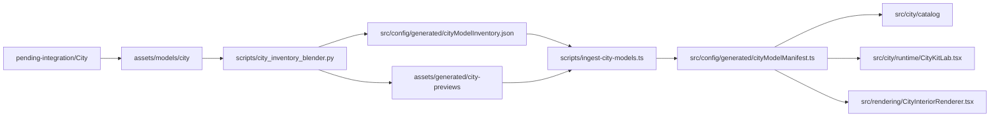

# City Config Pipeline

## Pipeline



## Generated Data

The ingest pipeline now produces:

- model asset import
- preview asset import
- bounds
- mesh count
- object count
- material list
- mesh name list
- baseline semantic classification

## Baseline Semantic Fields

The generated manifest currently emits:

- `family`
- `subcategory`
- `placementType`
- `footprint`
- `defaultScale`
- `defaultRotation`
- `rotationSymmetry`
- `pivotPolicy`
- `passabilityEffect`
- `zoneAffinity`
- `adjacencyBias`
- `compositeEligibility`
- `tags`

These are generated from measurable data plus filename heuristics, then consumed by:

- city catalog filtering
- layout grammar
- validation rules
- composite selection
- the City Kit Lab

## Regeneration

Run:

```bash
pnpm city:ingest
```

This will:

1. load every GLB from `assets/models/city`
2. render a preview PNG for each model
3. emit raw measured inventory JSON
4. emit a static-import TypeScript manifest for runtime use
