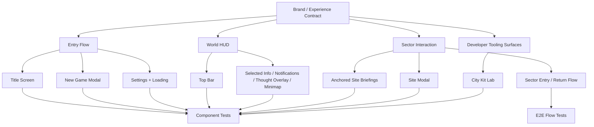

# Claude UI Polish Plan

This plan is the execution contract for Claude-driven UI and UX refinement work. It translates the main design and technical docs into concrete player-surface requirements.

## Mission

Bring every player-visible surface into alignment with the game’s actual identity, runtime contracts, and persistence-backed ecumenopolis sector structure.

This is not a mockup pass. It is a real product pass.

## Required Inputs

Claude must stay aligned with:
- [`/Users/jbogaty/src/arcade-cabinet/syntheteria/docs/GAME_DESIGN.md`](/Users/jbogaty/src/arcade-cabinet/syntheteria/docs/GAME_DESIGN.md)
- [`/Users/jbogaty/src/arcade-cabinet/syntheteria/docs/TECHNICAL.md`](/Users/jbogaty/src/arcade-cabinet/syntheteria/docs/TECHNICAL.md)
- [`/Users/jbogaty/src/arcade-cabinet/syntheteria/docs/LORE.md`](/Users/jbogaty/src/arcade-cabinet/syntheteria/docs/LORE.md)
- [`/Users/jbogaty/src/arcade-cabinet/syntheteria/docs/WORLD_AND_CITY_SYSTEMS.md`](/Users/jbogaty/src/arcade-cabinet/syntheteria/docs/WORLD_AND_CITY_SYSTEMS.md)
- [`/Users/jbogaty/src/arcade-cabinet/syntheteria/docs/UI_BRAND_AND_EXPERIENCE.md`](/Users/jbogaty/src/arcade-cabinet/syntheteria/docs/UI_BRAND_AND_EXPERIENCE.md)
- [`/Users/jbogaty/src/arcade-cabinet/syntheteria/docs/ASSET_GAPS.md`](/Users/jbogaty/src/arcade-cabinet/syntheteria/docs/ASSET_GAPS.md)

## Workstream Map

## Task List

### 1. Entry Flow Polish
- `completed` Remove anti-diegetic text clutter: status strip, Memory Lattice, Signal Relay header, text under buttons.
- `completed` Center buttons in viewport — background art IS the title, buttons float over it.
- `completed` Add proper modal backdrop (88% dark), X close button, sticky action footer.
- `completed` Improve OptionCard selection contrast: filled dot indicator, stronger border/bg, shadow glow.
- `completed` Add seed input aria-label.
- `completed` Refine loading overlay so it communicates generation/hydration state with brand-aligned feedback.
- `completed` Ensure `New Game`, `Continue`, and `Settings` retain clear accessibility treatment (ARIA roles, focus-visible).
- `completed` Settings overlay has modal role (`role="dialog"`, `aria-modal`), auto-focus on open.

### 2. In-Game Shell Polish
- `completed` Remove "Storm Command Uplink" header — TopBar is now a single thin telemetry strip.
- `completed` Collapse TopBar to minimal resource readouts + sim speed + pause in one row.
- `completed` ThoughtOverlay repositioned to center-screen — no longer fights with TopBar.
- `completed` GameUI gated behind sceneReady — no HUD during loading.
- `completed` Minimap timing — deferred until `currentTick > 0` (world interactive).
- `completed` BriefingBubbleLayer timing — deferred until `currentTick > 0` (world interactive).
- `completed` Notifications panel positioning — adjusted from `top-36` to `top-14 md:top-16` for new thin TopBar.

### 3. Sector Interaction Polish
- `completed` Refine local site/context surfaces so sector-site context is unmistakable.
- `completed` Refine site modal for survey / found / enter / return clarity.
- `pending` Playtest city transition flow end-to-end (not yet tested in Chrome DevTools).
- `pending` Verify radial menu works for all contextual actions.

### 4. City Tooling Surface Polish
- `completed` City Kit Lab responsive grid with viewport-aware card widths.
- `pending` Playtest City Kit Lab via Chrome DevTools.

### 5. Accessibility Pass
- `completed` ARIA roles, labels, focus trap, radio semantics.
- `completed` Seed input aria-label added.
- `completed` OptionCard accessibilityRole="radio" + accessibilityState.
- `completed` Modal close button with accessibilityRole="button" + accessibilityLabel.
- `completed` Focus-visible styles globally — `:focus-visible` ring on all interactive elements, suppressed for mouse/touch.
- `completed` Focus trap seeded for modals — NewGameModal and SettingsOverlay auto-focus close button on open, `role="dialog"` + `aria-modal`.
- `completed` Document title "Syntheteria" — already set in app.json `web.title`.

### 6. Testing Ownership
- `completed` assetUri.test.ts — 5 tests covering string passthrough, numeric expo-asset, web fallback.
- `completed` TitleScreen.test.ts — 7 tests passing after title screen redesign.
- `completed` 47/47 Jest suites, 186/186 tests passing.
- `completed` Playwright component tests updated — 27/27 passing. Stale expectations fixed (CitySiteModal copy, EcumenopolisRadialBot district actions).
- `completed` Snapshot updates for redesigned components (NewGameModal, CityKitLab, EcumenopolisWorld, etc.).
- `pending` Update E2E onboarding flow screenshots (may drift from visual changes).

### 7. Runtime Stability
- `completed` Canvas crash fixed — assetUri.ts returns empty string fallback on web.
- `completed` Simulation crash fixed — enemies.ts guards against missing structural fragments.
- `completed` ErrorBoundary uses branded dark theme instead of alarm red.
- `completed` Circular dependency in bots module broken.
- `completed` Deprecation warnings addressed (pointerEvents moved to style).
- `completed` Verbose entity logging in gameState.ts removed.

## Communication Rules

Claude should communicate progress by updating this file.

For every meaningful chunk:
1. change the relevant task status
2. add a dated progress note in the log below
3. list changed files
4. list tests updated or added
5. note remaining risks

## Progress Log

- 2026-03-11: Plan created. No Claude-owned UI polish work has been merged through this document yet.
- 2026-03-11: Codex answered Claude's blocking questions and canonicalized the decisions into `CLAUDE.md` and `docs/UI_BRAND_AND_EXPERIENCE.md`. Key decisions: preserve the cyan/mint split as intentional, replace dev-facing player copy with diegetic operational language, remove the tech-stack footer from the title experience, keep loading progress honest, use honest settings empty states, and treat 21st.dev as inspiration only.
- 2026-03-11: Phase 0-3 executed. Design system foundation (HudPanel `signal` variant, HudButton `utility` variant), entry flow diegetic copy pass, settings honest states, loading overlay indeterminate sweep, sector/site copy cleanup, semantic variant assignment across all HUD surfaces. Tests updated for TitleScreen, HudButton, LoadingOverlay.
  - **Files changed:** `src/ui/components/HudPanel.tsx`, `src/ui/components/HudButton.tsx`, `src/ui/TitleScreen.tsx`, `src/ui/NewGameModal.tsx`, `src/ui/LoadingOverlay.tsx`, `src/ui/CitySiteModal.tsx`, `src/ui/panels/SelectedInfo.tsx`, `src/ui/panels/BuildToolbar.tsx`
  - **Tests updated:** `tests/components/TitleScreen.spec.tsx`, `tests/components/HudButton.spec.tsx`
  - **Remaining:** City Kit Lab polish, focus/keyboard audit, motion audit, E2E updates, stale test cleanup
- 2026-03-11: Phase 4-5 partial. Responsive pass across ALL player-facing surfaces. Every panel, modal, toolbar, and overlay now uses NativeWind `md:` breakpoints for phone→tablet→desktop. CityKitLab model grid dynamically computes card width from viewport (2-col phone, 3-col tablet, 4-col desktop). Touch targets ≥36-44px throughout. Minimap scales via `useWindowDimensions`. TopBar stacks on mobile. Legacy side-panel surfaces were prepared for mobile collapse and later replacement by lighter anchored context surfaces.
  - **Files changed:** `src/ui/TitleScreen.tsx`, `src/ui/NewGameModal.tsx`, `src/ui/LoadingOverlay.tsx`, `src/ui/CitySiteModal.tsx`, `src/ui/panels/SelectedInfo.tsx`, `src/ui/panels/BuildToolbar.tsx`, `src/ui/panels/TopBar.tsx`, `src/ui/panels/Minimap.tsx`, `src/ui/panels/ThoughtOverlay.tsx`, `src/city/runtime/CityKitLab.tsx`
  - **Remaining:** Focus/keyboard audit, motion audit, E2E updates, stale test cleanup, CityKitLab screenshot coverage
- 2026-03-12: Frontend playtest via Chrome DevTools MCP surfaced 20+ issues. Full report at `docs/plans/FRONTEND_PLAYTEST_REPORT.md`.
- 2026-03-12: P0 crash fixes — `assetUri.ts` returns fallback on web (no more Canvas crash), `enemies.ts` guards against missing structural fragments (no more 989 console errors), `App.tsx` gates GameUI behind sceneReady (no more simultaneous UI layers), ErrorBoundary uses branded dark theme.
- 2026-03-12: Title screen redesign — removed anti-diegetic text clutter (status strip, Memory Lattice, Signal Relay header, text under buttons). Buttons now centered in viewport over the background painting. Minimal version stamp bottom-right.
- 2026-03-12: HUD redesign — removed "Storm Command Uplink" header. TopBar collapsed to single thin telemetry strip with resource readouts and sim controls. ThoughtOverlay repositioned to center-screen for clear narrative voice.
- 2026-03-12: Modal improvements — New Game modal: stronger backdrop (88% dark), X close button with accessibility, sticky action footer always visible, radio selection indicators with glow/shadow, seed input aria-label.
- 2026-03-12: Accessibility — ARIA roles/labels on buttons, images, radio groups, modal close. Dialog role on SettingsOverlay. accessibilityRole="radio" + accessibilityState on OptionCards.
- 2026-03-12: Stability — circular dependency in bots/ broken, deprecation warnings addressed (pointerEvents moved to style), debug entity logging removed from gameState.ts.
- 2026-03-12: Tests — 47/47 suites passing, 186/186 tests, zero TypeScript errors.
  - **Files changed:** `App.tsx`, `src/config/assetUri.ts`, `src/config/assetUri.test.ts`, `src/systems/enemies.ts`, `src/ecs/gameState.ts`, `src/ui/TitleScreen.tsx`, `src/ui/NewGameModal.tsx`, `src/ui/panels/TopBar.tsx`, `src/ui/panels/ThoughtOverlay.tsx`, `src/ui/panels/ResourceStrip.tsx`
  - **Remaining:** Focus-visible global styles, focus trap for modals, document title, Playwright component test updates for redesigned UI, E2E flow updates, minimap/briefing timing gates, city transition playtest
- 2026-03-12: Accessibility completion — focus-visible CSS globally (`:focus-visible` ring + `:focus:not(:focus-visible)` suppression), `role="dialog"` + `aria-modal` on NewGameModal, auto-focus on dialog open for both NewGameModal and SettingsOverlay.
- 2026-03-12: Timing gates — Minimap, BriefingBubbleLayer, and Notifications deferred until `currentTick > 0` (world must be ticking). Prevents HUD elements from flashing before world is interactive.
- 2026-03-12: Notifications positioning — adjusted from `top-36` to `top-14 md:top-16` to sit below the new thin TopBar instead of the old two-row layout.
- 2026-03-12: Playwright CT test fixes — 27/27 passing. Fixed stale expectations: CitySiteModal "Surveyed Interior" → "Surveyed District", "Found Research Campus" → "Establish Research Substation"; EcumenopolisRadialBot district actions updated to match new district operation roster. All snapshots regenerated.
  - **Files changed:** `src/ui/GameUI.tsx`, `src/ui/NewGameModal.tsx`, `src/ui/TitleScreen.tsx`, `src/ui/panels/Notifications.tsx`, `global.css`, `tests/components/CitySiteModal.spec.tsx`, `tests/components/EcumenopolisRadialBot.spec.tsx`
  - **Tests updated:** 27/27 Playwright CT, 47/47 Jest, 186/186 unit tests, 0 TS errors
  - **Remaining:** E2E onboarding flow screenshots, Chrome DevTools playtest of city transitions and radial menu
