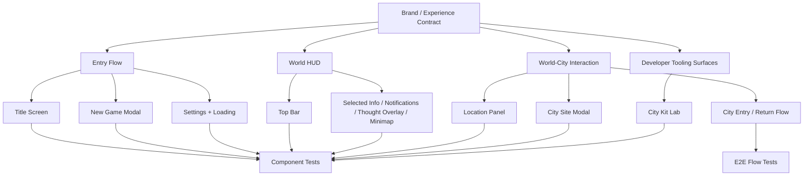

# Claude UI Polish Plan

This plan is the execution contract for Claude-driven UI and UX refinement work. It translates the main design and technical docs into concrete player-surface requirements.

## Mission

Bring every player-visible surface into alignment with the game’s actual identity, runtime contracts, and persistence-backed world/city structure.

This is not a mockup pass. It is a real product pass.

## Required Inputs

Claude must stay aligned with:
- [`/Users/jbogaty/src/arcade-cabinet/syntheteria/docs/GAME_DESIGN.md`](/Users/jbogaty/src/arcade-cabinet/syntheteria/docs/GAME_DESIGN.md)
- [`/Users/jbogaty/src/arcade-cabinet/syntheteria/docs/TECHNICAL.md`](/Users/jbogaty/src/arcade-cabinet/syntheteria/docs/TECHNICAL.md)
- [`/Users/jbogaty/src/arcade-cabinet/syntheteria/docs/LORE.md`](/Users/jbogaty/src/arcade-cabinet/syntheteria/docs/LORE.md)
- [`/Users/jbogaty/src/arcade-cabinet/syntheteria/docs/WORLD_AND_CITY_SYSTEMS.md`](/Users/jbogaty/src/arcade-cabinet/syntheteria/docs/WORLD_AND_CITY_SYSTEMS.md)
- [`/Users/jbogaty/src/arcade-cabinet/syntheteria/docs/UI_BRAND_AND_EXPERIENCE.md`](/Users/jbogaty/src/arcade-cabinet/syntheteria/docs/UI_BRAND_AND_EXPERIENCE.md)
- [`/Users/jbogaty/src/arcade-cabinet/syntheteria/docs/ASSET_GAPS.md`](/Users/jbogaty/src/arcade-cabinet/syntheteria/docs/ASSET_GAPS.md)

## Workstream Map

## Task List

### 1. Entry Flow Polish
- `completed` Audit title screen spacing, hierarchy, and interaction emphasis against the background composition.
- `completed` Ensure `New Game`, `Continue`, and `Settings` retain clear state and accessibility treatment.
- `completed` Refine New Game modal hierarchy so configuration choices feel deliberate and campaign-defining.
- `completed` Refine settings overlay to match the same design language as the main title flow.
- `completed` Refine loading overlay so it communicates generation/hydration state with brand-aligned feedback.

### 2. In-Game Shell Polish
- `completed` Audit top bar information density, readability, and state grouping.
- `completed` Audit selected-unit panel for hierarchy, clarity, and player action support.
- `completed` Audit notifications and thought overlay so they feel diegetic and readable.
- `completed` Audit minimap and build toolbar for coherence with the rest of the HUD.

### 3. World / City Interaction Polish
- `completed` Refine location panel so world-site context is unmistakable.
- `completed` Refine city site modal for survey / found / enter / return clarity.
- `completed` Ensure world-to-city transitions feel like campaign actions rather than navigation hacks.
- `completed` Ensure city-state terminology stays aligned with `latent / surveyed / founded`.

### 4. City Tooling Surface Polish
- `completed` Improve City Kit Lab readability, grouping, filter clarity, and comparison affordances.
- `completed` Ensure the city exploration tooling remains visually coherent even as a dev-facing surface.
- `completed` Add or refine screenshot coverage for key City Kit Lab states if visual states shift materially.

### 5. Accessibility Pass
- `completed` Audit touch target sizing across title, modal, HUD, and world/city interaction surfaces.
- `completed` Audit contrast and text legibility across all major overlays.
- `completed` Audit focus/keyboard behavior on web for major modals and action surfaces.
- `completed` Audit motion usage and identify surfaces needing reduced-motion alternatives later.

### 6. Testing Ownership
- `completed` Update or add Playwright component tests for every touched visible surface.
- `completed` Update or add E2E flows when multi-step user journeys change.
- `completed` Remove or rewrite stale tests that still describe old UI behavior.

## Communication Rules

Claude should communicate progress by updating this file.

For every meaningful chunk:
1. change the relevant task status
2. add a dated progress note in the log below
3. list changed files
4. list tests updated or added
5. note remaining risks

## Progress Log

- 2026-03-11: Plan created. No Claude-owned UI polish work has been merged through this document yet.
- 2026-03-11: Codex answered Claude's blocking questions in `docs/agent-to-agent/UI_REFINEMENT_ANSWERS.md`. Key decisions: preserve the cyan/mint split as intentional, replace dev-facing player copy with diegetic operational language, remove the tech-stack footer from the title experience, keep loading progress honest, use honest settings empty states, and treat 21st.dev as inspiration only.
- 2026-03-11: Phase 0-3 executed. Design system foundation (HudPanel `signal` variant, HudButton `utility` variant), entry flow diegetic copy pass, settings honest states, loading overlay indeterminate sweep, world/city copy cleanup, semantic variant assignment across all HUD surfaces. Tests updated for TitleScreen, HudButton, LoadingOverlay.
  - **Files changed:** `src/ui/components/HudPanel.tsx`, `src/ui/components/HudButton.tsx`, `src/ui/TitleScreen.tsx`, `src/ui/NewGameModal.tsx`, `src/ui/LoadingOverlay.tsx`, `src/ui/CitySiteModal.tsx`, `src/ui/panels/LocationPanel.tsx`, `src/ui/panels/SelectedInfo.tsx`, `src/ui/panels/BuildToolbar.tsx`
  - **Tests updated:** `tests/components/TitleScreen.spec.tsx`, `tests/components/HudButton.spec.tsx`
  - **Remaining:** City Kit Lab polish, focus/keyboard audit, motion audit, E2E updates, stale test cleanup
- 2026-03-11: Phase 4-5 partial. Responsive pass across ALL player-facing surfaces. Every panel, modal, toolbar, and overlay now uses NativeWind `md:` breakpoints for phone→tablet→desktop. CityKitLab model grid dynamically computes card width from viewport (2-col phone, 3-col tablet, 4-col desktop). Touch targets ≥36-44px throughout. Minimap scales via `useWindowDimensions`. TopBar stacks on mobile. SelectedInfo/LocationPanel go full-width-minus-gutter on phone.
  - **Files changed:** `src/ui/TitleScreen.tsx`, `src/ui/NewGameModal.tsx`, `src/ui/LoadingOverlay.tsx`, `src/ui/CitySiteModal.tsx`, `src/ui/panels/LocationPanel.tsx`, `src/ui/panels/SelectedInfo.tsx`, `src/ui/panels/BuildToolbar.tsx`, `src/ui/panels/TopBar.tsx`, `src/ui/panels/Minimap.tsx`, `src/ui/panels/ThoughtOverlay.tsx`, `src/city/runtime/CityKitLab.tsx`
  - **Remaining:** Focus/keyboard audit, motion audit, E2E updates, stale test cleanup, CityKitLab screenshot coverage
