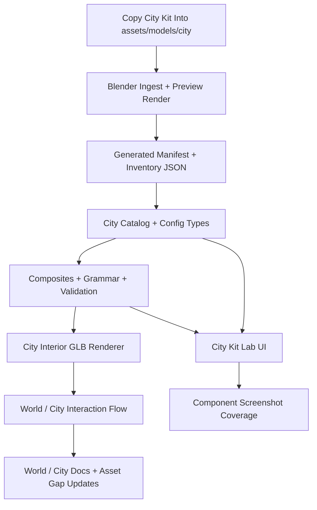

# World / City Completion PR Plan

## Goal

Turn the existing persistent world and placeholder city assembly into a production-grade world/city foundation built from the real in-repo city kit.

This branch now treats:

- `assets/models/city` as the authoritative runtime city-model root
- `assets/generated/city-previews` as the reproducible visual preview layer
- `src/config/generated/cityModelManifest.ts` as the generated baseline city model config
- `src/city/*` as the owned runtime/catalog/grammar/validation/composites package

## Delivery Tracks

1. City asset ingest and generated baseline config
2. City catalog, composites, grammar, and validation modules
3. In-app City Kit Lab with screenshot-testable previews and composite review
4. Real GLB-backed city interior rendering
5. World/city interaction surfaces that expose real city linkage and inspection
6. Tests and docs that keep the whole city kit understandable and reproducible

## Dependency Order

## Branch Tasks

1. Copy every city GLB into `assets/models/city`.
2. Generate one rendered preview per city model and measured metadata via Blender.
3. Emit `cityModelInventory.json` and `cityModelManifest.ts`.
4. Replace the old hand-authored city module catalog with manifest-backed catalog helpers.
5. Add first-class `CityModelDefinition`, `CityCompositeDefinition`, and `CityLayoutScenario` contracts.
6. Add canonical world snapshot contracts so persistence, active session state, ECS hydration, and nearby-POI UI consume one shared shape.
7. Add composited building clusters for tower, service block, and fabrication hub shapes.
8. Add config-validation and layout-resolution submodules so the city toolchain is testable as data and spatial math, not just through rendering.
9. Add city-understanding summaries so directory/family/snap/composition knowledge can be consumed as package data instead of staying trapped in the lab UI.
10. Add terrain atlas contract validation so world hex tilesets are mechanically verified as well as visually reviewed.
11. Replace debug city interior primitives with real GLB-backed placement rendering.
12. Add the City Kit Lab developer surface with filters for family, subdirectory, placement type, and compositing.
13. Add unit tests for catalog integrity, layout scenarios, layout validation, config validation, layout resolution, city understanding, and terrain atlas contracts.
14. Add Playwright component screenshot coverage for the City Kit Lab.
15. Update world/city docs and asset-gap docs to reflect the real city asset/runtime pipeline.

## Exit Criteria

- Every city model in `pending-integration/City` exists in `assets/models/city`.
- Every copied city model has a generated preview image.
- The manifest and inventory can be regenerated with `pnpm city:ingest`.
- The city runtime uses actual city GLBs, not placeholder primitives.
- The City Kit Lab can visually expose the full kit and composites in-app.
- The city catalog and scenarios are test-covered.
- The docs explain what the kit contains, how it is classified, and what still remains missing outside the city kit.
